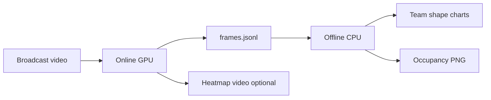

# Sports CV — Roboflow soccer analytics

Extensions on [roboflow/sports](https://github.com/roboflow/sports): pitch tracking export, occupancy heatmaps, and **offline team shape** metrics (defensive line, width, compactness).

## Quick start

```bash
cd sports_cv

# 1) Clone upstream (if not already present)
git clone https://github.com/roboflow/sports roboflow-sports
cd roboflow-sports && pip install -e . && cd ../examples/soccer && ./setup.sh
cd ../..

# 2) Online pass (GPU): video → JSONL + optional heatmap video
python render_heatmap_radar.py \
  --source_video_path roboflow-sports/examples/soccer/data/2e57b9_0.mp4 \
  --target_video_path outputs/2e57b9_0_heatmap.mp4 \
  --export_jsonl outputs/2e57b9_0_frames.jsonl \
  --minimap_only --viz accumulated \
  --export_final_png outputs/2e57b9_0_occupancy_online.png \
  --device cuda

# 3) Offline (CPU): shape + heatmap replay from JSONL
python analyze_team_shape.py \
  --jsonl outputs/2e57b9_0_frames.jsonl \
  --out_dir outputs/2e57b9_0_shape

python render_heatmap_offline.py \
  --jsonl outputs/2e57b9_0_frames.jsonl \
  --export_final_png outputs/2e57b9_0_occupancy_offline.png
```

Headless HPC: do not use `--show` on `roboflow-sports/examples/soccer/main.py`; use `--device cuda` on a GPU node.

## Pipeline overview



| Mode | Script | Input | Output |
|------|--------|-------|--------|
| **Online** | `render_heatmap_radar.py` | `.mp4` + YOLO weights | JSONL, video, PNG |
| **Offline** | `analyze_team_shape.py` | JSONL | Shape PNGs + `summary.json` |
| **Offline** | `render_heatmap_offline.py` | JSONL | Occupancy PNG (no GPU) |
| **Online** | `export_tracking.py` | `.mp4` | JSONL with **ball** (for possession later) |
| **Online** | `main.py --mode RADAR` | `.mp4` | RADAR + ball minimap |

More detail: [HEATMAP_README.md](HEATMAP_README.md), [OFFLINE_ANALYTICS.md](OFFLINE_ANALYTICS.md).

---

## Understanding results

See **[outputs/README.md](outputs/README.md)** for a file-by-file guide. Summary below.

### `frames.jsonl` (source of truth)

One JSON object per line (after optional `meta` line):

- `frame`, `time_s` — timeline  
- `players[]` — `track_id`, `team_id` (0/1 jersey cluster), `pitch_xy_cm` `[x, y]` in **centimeters** on the Roboflow pitch template (120 m × 70 m)  
- `ball` — only if exported via `export_tracking.py` (not in early heatmap-only exports)

All offline metrics read this file; **do not** measure the minimap in video pixels.

### Team shape — `outputs/<clip>_shape/`

Generated by `analyze_team_shape.py`.

| File | Meaning |
|------|---------|
| `line_height_timeline.png` | Deepest outfield player’s distance from **own goal line** (m). Higher curve = defensive line pushed up. |
| `width_timeline.png` | `max(y) − min(y)` across outfield players (m) — spread touchline to touchline. |
| `compactness_timeline.png` | Area of convex hull around outfield players (m²). Smaller = tighter block. |
| `shape_snapshot_*_f<frame>.png` | Dots + hull on pitch at ~25% / 50% / 75% of clip. |
| `summary.json` | Clip averages + which goal each team defends. |

**Defending side:** team with lower median `x` over the clip defends the **left** goal (`x = 0`). Label on snapshots: `T0 defends left goal | T1 defends right goal`.

**Coordinates:** homography can place points outside the pitch. We **clip** every `(x, y)` to `[0, 12000] × [0, 7000]` cm before hull and metrics so polygons stay on the field.

**Example (`2e57b9_0`, ~30 s segment):**

| Team | Defends | Mean line height (m) | Mean width (m) | Mean compactness (m²) |
|------|---------|----------------------|----------------|------------------------|
| 0 | left | 34.2 | 42.4 | 1191 |
| 1 | right | 21.1 | 43.9 | 1639 |

Interpretation for this clip: team 1’s back line stays **closer to its goal** (lower line height); team 1’s hull is **less compact** (larger area). Compare teams and moments, not absolute broadcast tactics.

### Heatmap — occupancy PNG

| File | Meaning |
|------|---------|
| `*_occupancy_online.png` | End state of online `--viz accumulated` |
| `*_occupancy_offline.png` | Same map rebuilt from JSONL (should match online) |

Cells show **where each team spent time** (dominant jersey color per cell). Complements shape metrics: heatmap = **territory**, shape = **structure at each instant**.

### RADAR / ball video

`main.py --mode RADAR` with ball detector: broadcast + minimap dots (teams + white ball). Visual only unless you export JSONL with ball.

---

## Repository layout

```
sports_cv/
├── README.md                 # this file
├── outputs/README.md         # result artifacts guide
├── analytics/                # heatmap, team_shape, load, possession, kinematics
├── render_heatmap_radar.py   # online heatmap + JSONL
├── render_heatmap_offline.py # offline heatmap from JSONL
├── analyze_team_shape.py     # offline shape charts
├── export_tracking.py        # JSONL with ball
├── soccer_infer.py           # shared inference helpers
└── roboflow-sports/          # upstream clone (not vendored in git)
```

---

## Limitations (state these in demos / PRs)

- Short broadcast clips; `team_id` is jersey clustering, not club names.  
- `track_id` can swap after occlusion.  
- Pitch coords are template homography, not stadium survey.  
- Line height uses **deepest outfield** player, not a full four-man line detector.  
- Smoothing: 7-frame rolling mean on shape timelines.  

---

## Planned upstream PRs (later)

1. RADAR + ball + supervision / headless fixes in `main.py`  
2. Heatmap module + offline replay  
3. `export_tracking.py` + shape analytics + notebook  

---

## License

Analytics code in this folder: your project license. `roboflow-sports` follows [its upstream license](https://github.com/roboflow/sports).
