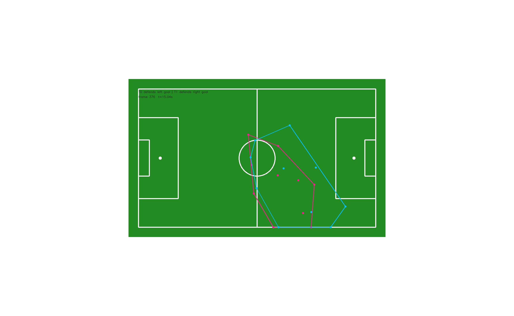
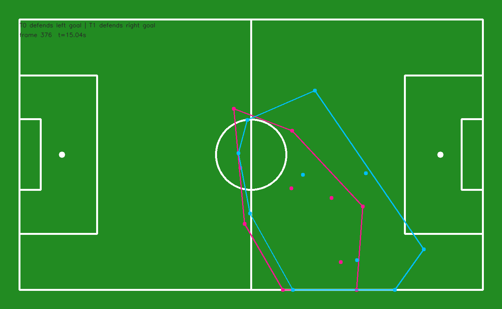
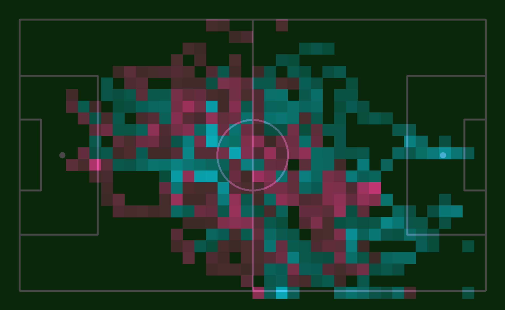
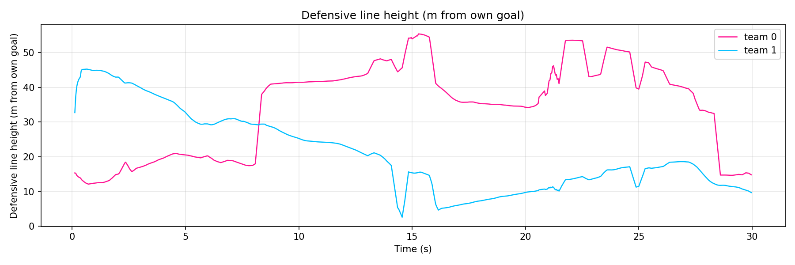
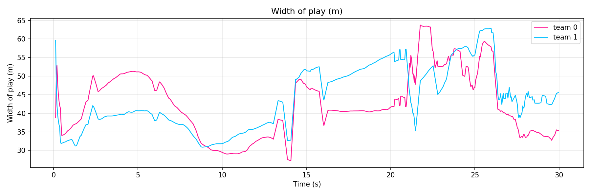
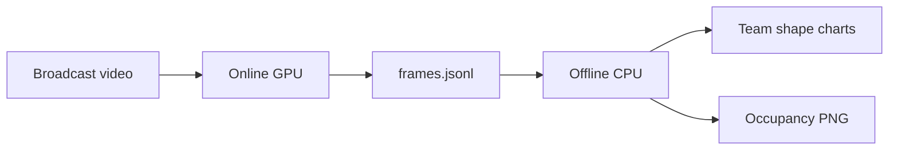

# Sports CV — Roboflow soccer analytics

Extensions on [roboflow/sports](https://github.com/roboflow/sports): export pitch tracking once, then run **occupancy heatmaps** and **team shape** analytics offline (defensive line, width, compactness).





---

## Run it (one command)

**Offline on bundled sample** (CPU only, no model download):

```bash
git clone https://github.com/Pratham-22/sports-cv-analytics.git
cd sports-cv-analytics
pip install supervision opencv-python-headless matplotlib numpy ultralytics  # offline deps
python run.py offline
```

Outputs → `outputs/demo_shape/` and `outputs/demo_occupancy.png`.

**Full pipeline** (GPU + upstream weights):

```bash
git clone https://github.com/roboflow/sports sports-cv-analytics/roboflow-sports
cd sports-cv-analytics/roboflow-sports && pip install -e . && cd examples/soccer && ./setup.sh && cd ../../..
python run.py full --video roboflow-sports/examples/soccer/data/2e57b9_0.mp4 --device cuda
```

---

## Sample results (embedded)

### Team shape on the pitch

Convex hull + player dots (coordinates clipped to pitch bounds). Pink = team 0, cyan = team 1.



### Where each team spent time

Occupancy heatmap from JSONL replay (offline, no GPU):



### Defensive line over time

Distance from own goal to the **deepest outfield** player (meters). **Higher** = line pushed up (high block). **Lower** = deeper block.



### Width of play over time

Spread along the touchline axis (meters). **Wider** = play stretched; **narrower** = compact horizontally.



---

## Metrics — geometry and tactics

| Metric | What we compute | Tactical read (heuristic) |
|--------|-----------------|---------------------------|
| **Line height** | Deepest outfield player’s distance from own goal (m) | Higher ≈ **high defensive line** (press up, reduce space in midfield). Lower ≈ **low block** (protect goal, invite pressure). |
| **Width** | `max(y) − min(y)` of outfield players (m) | Wider ≈ **stretching the pitch** (switch play, wing play). Narrower ≈ **narrow shape** (compact channels). |
| **Compactness** | Convex hull area (m²) | Smaller ≈ **tight block** (less space between lines). Larger ≈ **disorganized or stretched** shape. |

**Example clip `2e57b9_0` (~30 s):** team 0 mean line **34 m** vs team 1 **21 m** → team 1 holds a **deeper block** on average in this segment. Team 1 also has a **larger hull** (less compact). These are comparative signals for a short clip, not full-match StatsBomb-grade numbers.

**Defending side:** whichever team has the lower median `x` over the clip defends the **left** goal on the template pitch.

---

## Pipeline



| Step | Script | GPU? |
|------|--------|------|
| Export | `render_heatmap_radar.py` or `run.py full` | Yes |
| Shape | `analyze_team_shape.py` or `run.py offline` | No |
| Heatmap replay | `render_heatmap_offline.py` or `run.py offline` | No |

Details: [HEATMAP_README.md](HEATMAP_README.md), [OFFLINE_ANALYTICS.md](OFFLINE_ANALYTICS.md), [outputs/README.md](outputs/README.md).

### `frames.jsonl`

Per-frame: `track_id`, `team_id` (jersey cluster 0/1), `pitch_xy_cm` on a 120×70 m template. All offline tools read this file — do not scrape the minimap from video pixels.

---

## Repository layout

```
sports-cv-analytics/
├── run.py                    # entry point: offline | full
├── docs/images/              # README visuals + demo.gif
├── analytics/                # heatmap, team_shape, load, …
├── render_heatmap_radar.py   # online export
├── render_heatmap_offline.py
├── analyze_team_shape.py
└── roboflow-sports/          # clone separately (see setup)
```

---

## Limitations

Short broadcast clips; jersey-based `team_id`; homography jitter; deepest-player line proxy (not a 4-man offside line). State these when sharing results.

## Upstream PRs (later)

See [docs/UPSTREAM_PATCHES.md](docs/UPSTREAM_PATCHES.md) for planned contributions to [roboflow/sports](https://github.com/roboflow/sports).

---

## Replace the demo GIF

Record ~15 s of heatmap video or RADAR (`main.py --mode RADAR`) and overwrite:

`docs/images/demo.gif`

GitHub renders it inline at the top of this README.
